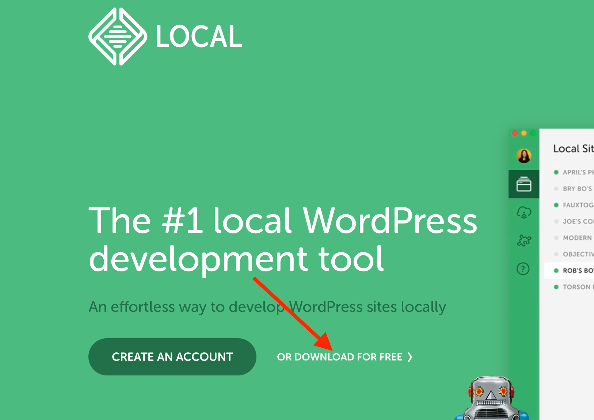
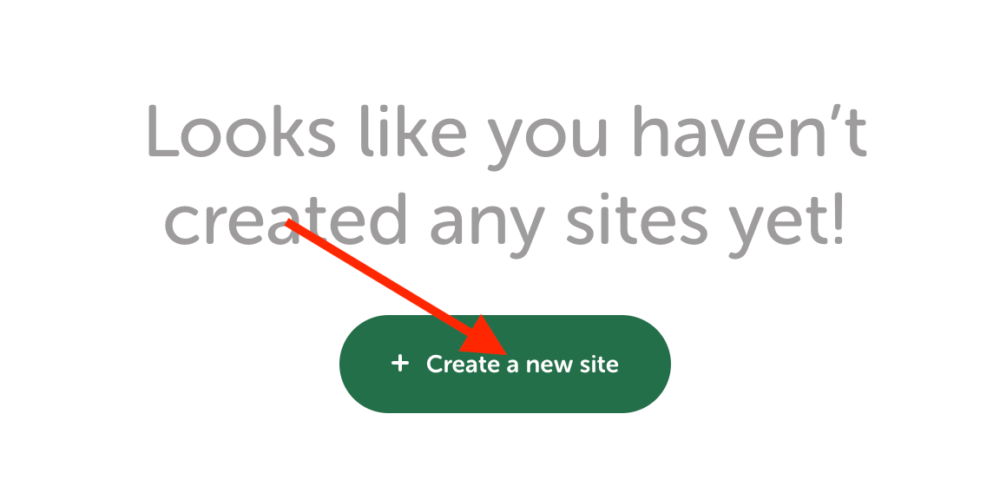
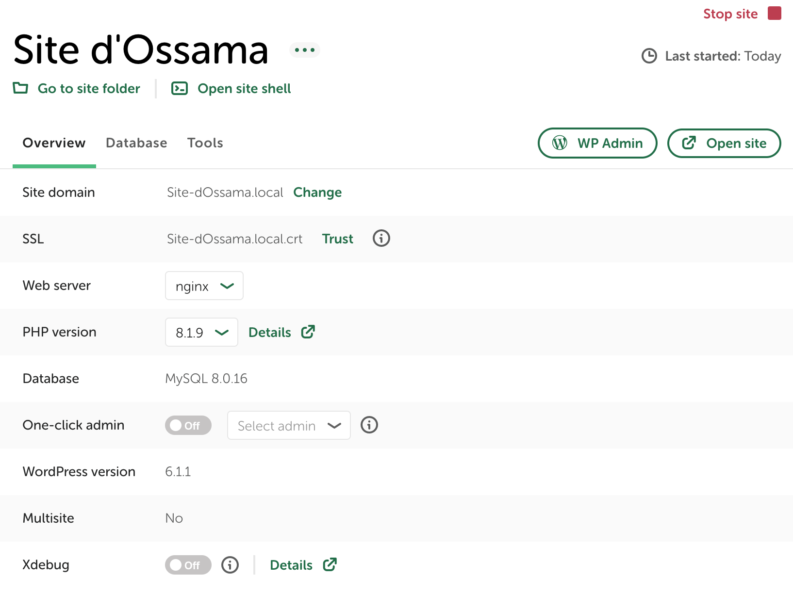
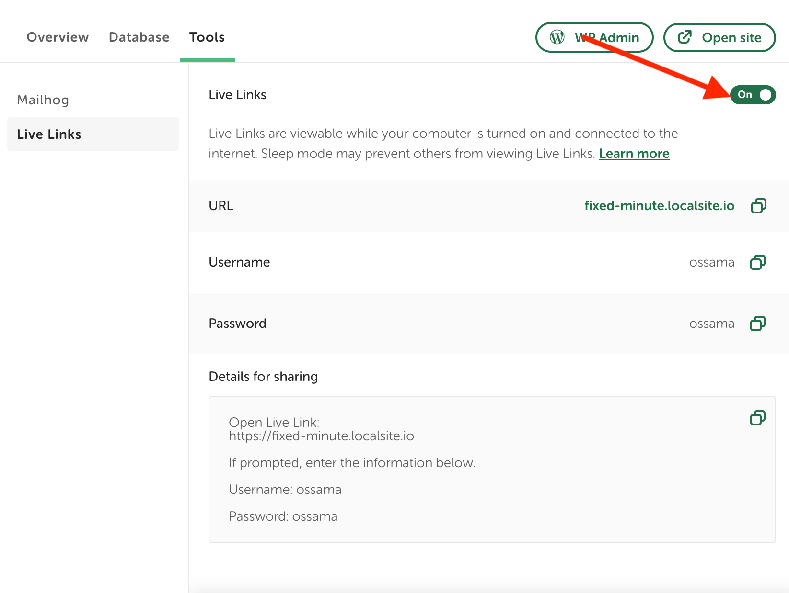

<!-- début résumé -->

Ce MON sert de tutoriel pour la création d'un site WordPress en local sur son ordinateur pour pouvoir facilement expérimenter des thèmes, des plugins et des fonctionnalités avant de les mettre en ligne sur un site en direct. Cela vous permet donc de développer et de tester votre site en toute sécurité, sans craindre de perturber les visiteurs du site.

<!-- fin résumé -->

### Présentation de WordPress

WordPress est un système de gestion de contenu (CMS) open-source qui permet aux utilisateurs de créer et de gérer facilement des sites web. Il est largement utilisé pour créer des blogs, des sites d'entreprise, des portfolios, des sites e-commerce et bien plus encore.

Il est écrit en PHP et utilise une base de données MySQL pour stocker les données. Il est également compatible avec une variété de serveurs web, y compris Apache et Nginx.

WordPress est facile à utiliser, même pour les utilisateurs qui n'ont pas de connaissances en développement web. Il offre une interface intuitive qui permet aux utilisateurs de créer et de publier du contenu, de gérer les utilisateurs et les commentaires, de personnaliser l'apparence de leur site et de gérer les extensions et les plugins.

Il est également très personnalisable grâce à des milliers de thèmes et de plugins gratuits et payants disponibles sur le marché. Il est très populaire, c'est l'un des CMS les plus utilisés dans le monde, il est utilisé par des millions de sites web.

### Avantage de créer un site WordPress en local

* **Développement et test** : En créant un site WordPress en local, vous pouvez facilement expérimenter avec des thèmes, des plugins et des fonctionnalités avant de les mettre en ligne sur un site en direct. Cela vous permet de développer et de tester votre site en toute sécurité, sans craindre de perturber les visiteurs de votre site en direct.

* **Rapidité** : En utilisant un serveur local pour héberger votre site, vous pouvez bénéficier de temps de chargement plus rapides pour vos pages, car les données sont stockées sur votre propre ordinateur, plutôt que sur un serveur distant.

* **Flexibilité** : En hébergeant votre site localement, vous avez une plus grande flexibilité pour personnaliser et configurer votre site selon vos préférences, sans être limité par les restrictions de votre hébergeur web.

* **Économie** : Héberger un site WordPress en local est gratuit alors qu'il est nécessaire de payer pour un hébergement web en ligne.

* **Sécurité** : Héberger un site WordPress en local peut offrir une meilleure sécurité pour vos données, car vous avez un contrôle complet sur le serveur et les données.

### Téléchargement du logiciel Local by Flywheel

Il existe plusieurs logiciels permettant la création d'un site WordPress en local, après en avoir essayé quelques uns, le meilleur que j'ai trouvé est Local by Flywheel. Ce logiciel est gratuit et permet d'avoir une interface utilisateur claire et intuitive qui facilite la création et la gestion de sites WordPress locaux. Il offre également une visualisation graphique des sites en cours d'exécution sur votre ordinateur. 

Pour commencer, il faut d'abord télécharger l'application en se rendant sur le site suivant : https://localwp.com. Il suffit ensuite de cliquer sur le lien de téléchargement comme sur l'image ci-dessous (il n'est pas nécessaire de créer de compte). Après avoir choisis son système d'exploitation, le téléchargement se lance. 

### Création d'un site

Après avoir ouvert l'application téléchargée, il faut cliquer sur "Create a new site" comme sur l'image ci-dessous :

Il faudra ensuite choisir un nom pour le site, sélectionnez "WordPress" comme type de site, et cliquez sur "Continue". Enfin, il va falloir choisir un emplacement pour le fichier du site sur l'ordinateur, et cliquez sur "Create Site".
Local by Flywheel va maintenant installer WordPress sur l'ordinateur et créer une base de données pour le site. Il demandera également de choisir un nom d'utilisateur et un mot de passe pour la base de donnée.

### Personnalisation du site

Le site est maintenant configuré !

#### Bouton "Open Site"

Le bouton "**Open Site**" permet d'ouvrir le site WordPress en local dans un navigateur web. Il vous permet de visualiser comment votre site apparaît et fonctionne sur un navigateur, ce qui est essentiel pour le développement et les tests de votre site.
En cliquant sur "Open Site", Local by Flywheel ouvrira automatiquement votre navigateur web par défaut et affichera votre site localement hébergé. Il vous permettra de naviguer sur votre site comme vous le feriez si vous étiez en ligne.

Cela est utile pour :

* Vérifier la mise en page et les fonctionnalités de votre site avant de le publier en ligne.
* Effectuer des tests utilisateurs pour recueillir des commentaires et des retours sur votre site.
* Présenter un projet à un client pour obtenir des commentaires et des approbations.

En utilisant le bouton "Open Site" sur Local by Flywheel, vous pouvez facilement vérifier comment votre site se comporte et se présente dans un navigateur web, ce qui est essentiel pour assurer la qualité et la fonctionnalité de votre site avant de le rendre public.

#### Bouton "WP Admin"

Le bouton "**WP Admin**" permet d'accéder à l'interface d'administration de votre site WordPress en local. Il vous permet de gérer le contenu et les paramètres de votre site, comme vous le feriez si votre site était en ligne.

En cliquant sur "WP Admin", Local by Flywheel ouvrira automatiquement votre navigateur web par défaut et affichera l'écran de connexion de l'administration de votre site localement hébergé. Vous devrez saisir votre nom d'utilisateur et votre mot de passe pour vous connecter.

Cela est utile pour :

Ajouter, éditer et supprimer des pages, des articles, des médias et autres types de contenu.
Personnaliser l'apparence de votre site en utilisant les thèmes et les widgets.
Gérer les utilisateurs et les commentaires.
Installer et configurer des plugins pour ajouter des fonctionnalités à votre site.
En utilisant le bouton "WP Admin" sur Local by Flywheel, vous pouvez facilement gérer et personnaliser votre site WordPress en local, ce qui est essentiel pour le développement et les tests de votre site avant de le rendre public.

### Partage d'un "Live Link"

Il est possible de partager un "Live Link" en activant l'option dans l'onglet "tools" comme sur l'image ci-dessous :

Le partage de ce lien permet de donner un aperçu du site en rentrant un identifiant et un mot de passe. L'envoi de ce lien permet :

* **Aperçu en direct** : Si vous travaillez sur un site WordPress en local ou sur un site de développement, vous pouvez partager un lien en direct pour permettre aux autres de voir les dernières mises à jour et de donner des commentaires avant de publier le site en direct.

* **Collaboration** : Si vous travaillez en équipe sur un site WordPress, vous pouvez partager un lien en direct pour permettre aux autres membres de l'équipe de voir les dernières mises à jour et de collaborer sur le contenu.

* **Partage avec des clients** : Si vous créez un site WordPress pour un client, vous pouvez partager un lien en direct pour permettre au client de voir les dernières mises à jour et de donner des commentaires avant de publier le site en direct.

* **Présentation de projet** : Si vous voulez montrer un projet WordPress que vous avez créé à un public plus large, vous pouvez partager un lien en direct pour permettre aux gens de voir le projet en action avant de le publier en direct.

* **Tests utilisateurs** : Si vous voulez recueillir des commentaires et des retours d'utilisateurs sur votre site WordPress avant de le publier en direct, vous pouvez partager un lien en direct pour permettre aux utilisateurs de naviguer sur le site et de donner leur avis.

### Ressources utilisées

* Tutoriel de WPMarmite : https://www.youtube.com/watch?v=rm73DF3BH38
* Site Local by Flywheel : https://localwp.com
* Site WordPress : https://wordpress.org 