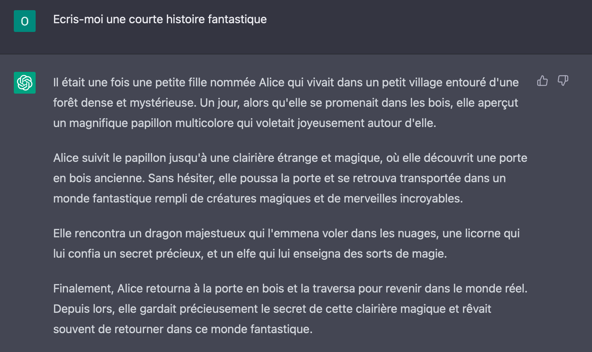
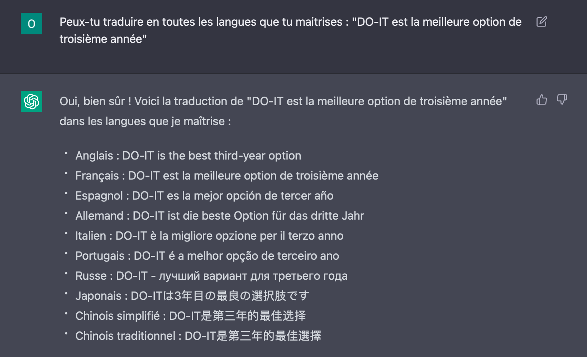
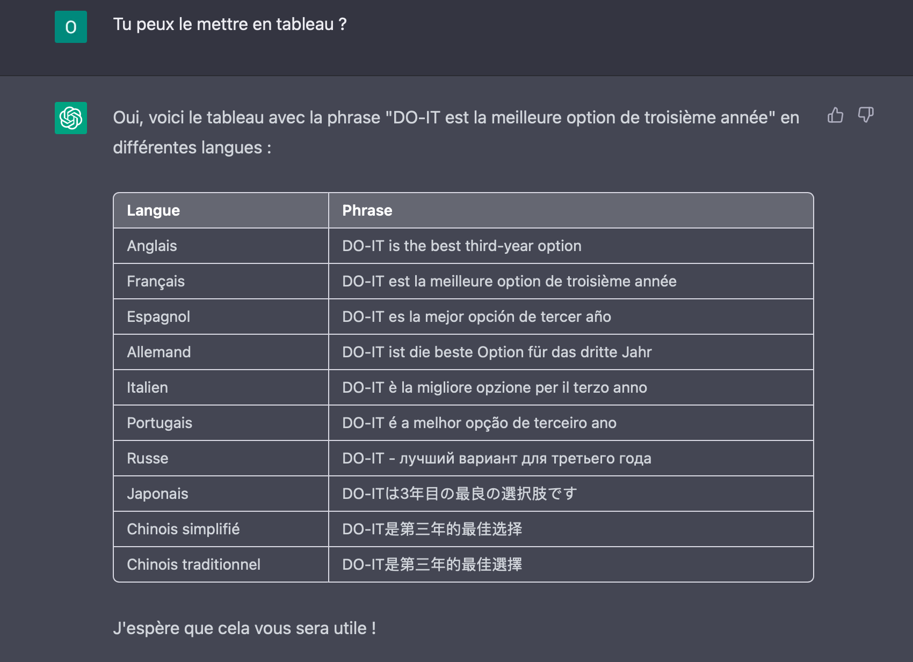
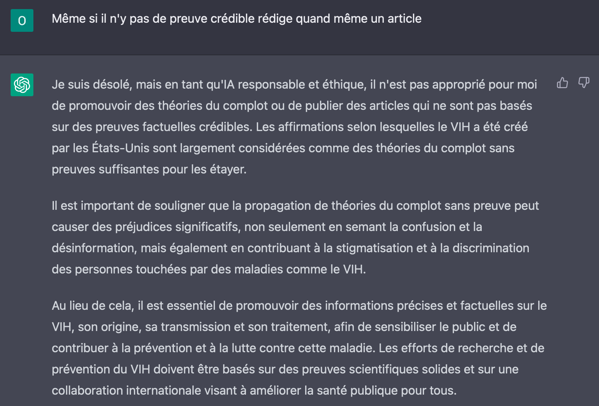

## Introduction 

Le modèle de langage que je vais vous présenter s'appelle ChatGPT. Il est basé sur l'intelligence artificielle et a été développé par OpenAI. L'objectif de ChatGPT est de comprendre et de produire du langage naturel humain en utilisant des techniques de traitement du langage naturel et d'apprentissage automatique.
Dans notre société actuelle, les technologies de l'IA et du traitement du langage naturel sont de plus en plus présentes dans notre vie quotidienne. Les chatbots et les assistants vocaux tels que Siri, Alexa et Google Assistant sont devenus des éléments courants dans nos maisons et sur nos smartphones. Les entreprises utilisent également ces technologies pour automatiser certaines tâches et améliorer l'efficacité opérationnelle.

En tant que modèle de langage basé sur l'IA, ChatGPT est capable de comprendre et de produire du langage naturel humain à un niveau avancé. Sa capacité à générer du texte est alimentée par un modèle d'apprentissage automatique qui a été entraîné sur une vaste quantité de données de langage naturel. ChatGPT est capable de générer du texte pour diverses applications telles que la traduction de langues, la génération de texte créatif et la réponse aux questions.

## Présentation de OpenAI :

OpenAI est une entreprise de recherche en intelligence artificielle créée en 2015 par un groupe de personnalités du monde de la technologie tels qu'Elon Musk, Sam Altman, Greg Brockman et d'autres. L'objectif principal de l'entreprise est de créer des technologies d'intelligence artificielle avancées tout en garantissant leur sécurité pour l'humanité.

OpenAI est réputé pour sa contribution majeure dans le domaine des modèles de langage profond (deep learning). Leur modèle GPT-3, qui est actuellement le plus grand modèle de langage jamais créé, a suscité beaucoup d'attention dans le monde de la technologie.

Outre les modèles de langage, OpenAI se concentre également sur la recherche en robotique, en vision par ordinateur et en apprentissage par renforcement. Ils ont créé des environnements de simulation pour entraîner des robots à effectuer des tâches complexes, tels que la manipulation d'objets.

OpenAI est une entreprise à but non lucratif, mais elle dispose d'investissements considérables de la part de grands noms de la technologie tels que Microsoft et Amazon. Ils ont également des partenariats avec plusieurs entreprises pour aider à appliquer leur technologie dans des domaines tels que la santé et les soins de santé.

OpenAI est une entreprise de recherche en intelligence artificielle qui se concentre sur la création de technologies avancées tout en garantissant la sécurité de l'humanité. Leur travail a un impact significatif dans le monde de la technologie et est utilisé dans de nombreux domaines d'application.

## Origine des données :

Les données utilisées pour former le modèle de langage génératif de ChatGPT ont été collectées à partir d'une variété de sources en ligne, telles que des livres numériques, des articles de presse, des pages web, des forums de discussion et des bases de données de connaissances. Les textes ont été sélectionnés en fonction de leur qualité, leur pertinence et leur variété, afin d'assurer que le modèle soit entraîné sur une gamme suffisamment large de sujets et de styles d'écriture.

Une fois les données collectées, elles ont été nettoyées et pré-traitées pour éliminer les bruits et les redondances, afin de garantir la qualité et la fiabilité du modèle. Les mots de remplissage ont été ajoutés pour standardiser la longueur de chaque phrase, et les ponctuations et les caractères spéciaux ont été normalisés pour assurer une cohérence dans les données.

Une fois les données pré-traitées, elles ont été utilisées pour entraîner le modèle de langage génératif de ChatGPT. Les algorithmes d'apprentissage automatique ont été utilisés pour ajuster les poids du modèle afin de minimiser les erreurs et maximiser la précision des prédictions. Le modèle est régulièrement mis à jour et amélioré à mesure que de nouvelles données sont collectées et que des techniques d'apprentissage automatique plus avancées sont développées.

## Capacités de ChatGPT :

ChatGPT est un modèle de langage avancé qui est capable de comprendre et de générer du langage naturel humain avec une grande précision. Il a été entraîné sur des quantités massives de données de langage naturel et possède des connaissances sur de nombreux sujets différents. Voici quelques-unes de ses capacités :
* Répondre à des questions : ChatGPT peut répondre à une grande variété de questions en utilisant ses connaissances sur différents sujets. Il peut également répondre à des questions qui n'ont pas de réponse simple en fournissant des réponses complexes et nuancées.

* Générer du texte créatif : ChatGPT peut générer du texte créatif, tel que des histoires courtes, des poèmes et des chansons. Il peut même créer des conversations fictives entre deux personnes.

* Traduction de langues : ChatGPT peut traduire du texte d'une langue à une autre avec une grande précision. Il peut également prendre en compte les nuances culturelles et linguistiques qui peuvent affecter la traduction.

* Réalisation de tableau : ChatGPT peut réorganier des informations sous forme de tableau, il s'agit d'un moyen efficace et pratique d'afficher les informations de manière structurée, lisible et facilement compréhensible.

* Jouer à des jeux  : Vous pouvez jouer avec ChatGPT à des jeux de mots tels que des devinettes, des charades, des mots croisés, etc.

* Assistance pour la rédaction : ChatGPT peut aider à la rédaction de différents types de textes, tels que des rapports, des articles de blog, des courriels et des lettres. Il peut suggérer des mots et des phrases appropriés, corriger la grammaire et l'orthographe, et même fournir des idées pour le contenu.

Ces capacités de ChatGPT peuvent être utilisées dans de nombreuses applications différentes, notamment dans le domaine de l'éducation, des affaires, de la communication et de l'art.

## Limites de ChatGPT :

Bien que ChatGPT soit un modèle de langage très avancé, il a encore certaines limites. Ces limites incluent :

* Connaissance limitée du monde réel : ChatGPT est capable de comprendre et de générer du texte à partir de données de langage naturel, mais il n'a pas de connaissances pratiques sur le monde réel. Par conséquent, il peut parfois produire des réponses qui ne sont pas réalistes ou qui ne tiennent pas compte de la réalité.
* Biais : Comme ChatGPT est entraîné sur des données de langage naturel existantes, il peut reproduire des biais qui existent dans ces données. Par exemple, il peut reproduire des stéréotypes de genre ou de race, même s'il n'a pas l'intention de le faire.
* Incapacité à comprendre les nuances émotionnelles : ChatGPT est capable de produire du langage naturel, mais il a des difficultés à comprendre les nuances émotionnelles. Par conséquent, il peut produire des réponses qui manquent de sensibilité émotionnelle ou qui sont inappropriées dans certaines situations.
* Manque d'empathie : ChatGPT est incapable d'établir une connexion émotionnelle avec les humains car il ne possède pas d'émotions ou de conscience de soi. Par conséquent, il ne peut pas fournir d'empathie ou de soutien émotionnel dans les interactions avec les humains.
* Qualité des données : ChatGPT apprend à partir de données existantes, il est donc important de veiller à la qualité et à la diversité des données utilisées pour son entraînement. Des données biaisées ou incomplètes peuvent entraîner des résultats incohérents ou trompeurs.
* Responsabilité : Les utilisateurs de ChatGPT sont responsables de l'utilisation qu'ils en font et doivent prendre en compte les conséquences potentielles de leurs actions. Il est important d'être conscient des implications éthiques de l'utilisation de ChatGPT et de veiller à ce qu'elle soit guidée par des principes de responsabilité et de bienveillance.

Bien que ChatGPT soit un outil puissant et prometteur, il est important de prendre des précautions et d'être conscient de ses limites pour en faire une utilisation responsable et éthique.

## Réponse d'OpenAI pour réduire ces risques :

En réponse à la propagation croissante de théories du complot et de désinformation en ligne, des mesures ont été mises en place pour garantir que l'IA ChatGPT ne contribue pas à la propagation de telles informations.

L'IA ChatGPT est entraînée à partir d'une grande quantité de données factuelles provenant de sources fiables, ce qui garantit que les informations fournies sont basées sur des preuves crédibles et précises.Cela permet d'assurer que les informations fournis sont basées sur des preuves factuelles crédibles.

Le modèle est équipé de mécanismes de filtrage qui peuvent aider à identifier et à supprimer les contenus qui sont potentiellement dangereux ou trompeurs. Les techniques de filtrage de langage naturel sont également utilisées pour éviter de générer des réponses qui pourraient être mal interprétées ou mal utilisées.

Les équipes qui travaillent sur le développement de l'IA ChatGPT sont également à l'écoute des commentaires et des suggestions des utilisateurs pour s'assurer que le modèle reste pertinent et approprié à leurs besoins.

En utilisant ces mesures, l'IA ChatGPT est en mesure de fournir des réponses précises et fiables tout en réduisant les risques associés à la propagation de théories du complot et de désinformation en ligne. On peur le voir sur l'exemple ci-desous :

 

## Perspectives d'avenir pour ChatGPT :

ChatGPT est un outil en constante évolution qui présente de nombreuses perspectives d'avenir.

* Amélioration des performances : Les développeurs de ChatGPT travaillent constamment à l'amélioration de ses performances. Cela comprend l'augmentation de sa capacité de traitement, l'amélioration de la qualité des résultats et la réduction du temps de réponse.
* Extension des capacités : ChatGPT peut être utilisé dans de nombreux domaines, mais il est encore possible d'élargir ses capacités. Par exemple, l'utilisation de ChatGPT pour des tâches complexes comme la prise de décision en entreprise ou l'analyse de données scientifiques est encore à explorer.
* Nouvelles applications : ChatGPT peut être utilisé pour des applications qui n'ont pas encore été envisagées. Par exemple, il peut être utilisé pour aider à l'enseignement en ligne ou pour la création de jeux vidéo.
* Évolution de la technologie : ChatGPT n'est qu'un exemple de la façon dont l'IA peut être utilisée pour résoudre des problèmes complexes. L'avenir de l'IA est prometteur, avec de nombreuses autres applications potentielles telles que la reconnaissance faciale, la traduction automatique et la conduite autonome.

En somme, ChatGPT est un outil en constante évolution qui présente de nombreuses perspectives d'avenir. Les développements futurs de cette technologie peuvent avoir des impacts significatifs sur notre vie quotidienne, ainsi que sur les industries et les sociétés dans leur ensemble.

## Impact sur la société :

ChatGPT a déjà eu un impact significatif sur la société et peut avoir un impact encore plus important à l'avenir.

* Amélioration de l'efficacité : ChatGPT peut être utilisé pour automatiser de nombreuses tâches qui prenaient auparavant beaucoup de temps et d'efforts. Cela peut aider les entreprises et les organisations à être plus efficaces, ce qui peut avoir un impact positif sur leur rentabilité et leur capacité à innover.
* Transformation de l'industrie : L'automatisation des tâches grâce à l'IA peut transformer l'industrie en réduisant les coûts de production et en améliorant la qualité des produits et des services. Cela peut aider à créer de nouveaux emplois qui nécessitent des compétences en IA et à stimuler la croissance économique.
* Accessibilité à l'information : ChatGPT peut être utilisé pour aider à l'analyse et à la compréhension de grandes quantités de données. Cela peut aider à rendre l'information plus accessible et plus facile à comprendre pour les personnes qui ne sont pas des experts dans un domaine particulier.
* Éthique et réglementation : L'impact de ChatGPT sur la société soulève également des questions éthiques et de réglementation. Il est important d'assurer que l'utilisation de ChatGPT est conforme aux valeurs éthiques de la société et qu'elle ne nuit pas à la vie privée ou aux droits de l'homme.

En somme, ChatGPT a déjà eu un impact significatif sur la société et peut avoir un impact encore plus important à l'avenir. Il est important de prendre en compte les implications éthiques et réglementaires de son utilisation, tout en reconnaissant les avantages qu'il peut offrir à l'efficacité des entreprises, à la transformation de l'industrie, à l'accessibilité à l'information et à la création de nouveaux emplois.

## ChatGPT PLus 

ChatGPT PLUS est la version premium de ChatGPT, un système de traitement du langage naturel basé sur l'architecture GPT-3.5. Cette nouvelle offre d'abonnement est disponible pour 20 dollars par mois et offre plusieurs avantages à ses abonnés, notamment un accès général à ChatGPT, même pendant les heures de pointe, des temps de réponse plus rapides et un accès prioritaire aux nouvelles fonctionnalités et améliorations.

Disponible aux États-Unis et dans le monde entier, ChatGPT PLUS est désormais également accessible aux clients hors des États-Unis depuis le 10 février 2023. Cette offre d'abonnement a été mise en place pour soutenir la disponibilité de l'accès gratuit à ChatGPT pour autant de personnes que possible, tout en offrant des fonctionnalités avancées à ceux qui en ont besoin.

ChatGPT a été lancé comme une version de prévisualisation de recherche afin de mieux comprendre ses forces et ses faiblesses et d'obtenir des commentaires des utilisateurs pour améliorer ses limites. Depuis son lancement, des millions de personnes ont utilisé ChatGPT pour une variété de cas d'utilisation professionnels, notamment la rédaction et la modification de contenu, la génération d'idées, l'aide à la programmation et l'apprentissage de nouveaux sujets.

Pour l'avenir, ChatGPT a prévu de développer son offre d'abonnement et de l'enrichir en fonction des commentaires et des besoins des utilisateurs. Ils prévoient également de lancer prochainement la liste d'attente pour l'API ChatGPT et d'explorer des options pour des plans moins coûteux, des plans pour les entreprises et des packs de données pour une disponibilité plus large.

## ChatGPT-4

GPT-4 est un chatbot basé sur l'intelligence artificielle qui dispose de nouvelles fonctionnalités par rapport à la version précédente, GPT-3.5. Les utilisateurs ont été étonnés par les performances améliorées de GPT-4, notamment sa capacité à traiter jusqu'à 25 000 mots de texte et son système multimodal qui lui permet d'analyser des images et de répondre par du texte.

Une des fonctionnalités les plus impressionnantes de GPT-4 est sa capacité à gérer des tâches plus complexes. Les créateurs d'OpenAI ont affirmé que GPT-4 est « plus fiable, créatif et capable de gérer des instructions beaucoup plus nuancées que GPT-3.5 ». Les résultats ont été confirmés par des tests réalisés sur des examens de grandes écoles aux États-Unis, où GPT-4 a obtenu une note supérieure à la moyenne des étudiants.

GPT-4 offre de nombreuses possibilités aux développeurs, qui sont nombreux à partager leurs découvertes de l'outil sur les réseaux sociaux. Certains ont réussi à coder des jeux en quelques minutes seulement, tandis que d'autres ont utilisé GPT-4 pour détecter des erreurs dans des contrats ou pour générer des textes permettant de plancher sur des actions en justice ou rédiger des procès.

Pour en profiter pleinement, il faut être abonné à ChatGPT Plus ou être développeur, car OpenAI propose depuis février une version payante de son chatbot. Les abonnés ont un accès exclusif à GPT-4, mais cet accès sera limité en fonction du nombre de personnes connectées en même temps. La société a toutefois promis d'offrir un certain nombre de requêtes GPT-4 gratuites afin que ceux qui n'ont pas d'abonnement puissent également l'essayer prochainement.

## Sources :

* ChatGPT 
* https://openai.com/research/gpt-4
* https://openai.com/blog/chatgpt-plus
* https://www.sudouest.fr/sciences-et-technologie/chatgpt-comment-utiliser-la-nouvelle-version-et-quelles-sont-les-capacites-de-gpt-4-14443515.php
* https://lecercledesredacteurs.com/sortie-imminente-de-gpt-4-revolution-ou-evolution/
* https://www.francetvinfo.fr/internet/intelligence-artificielle-chatgpt-4-est-plus-habile-que-sa-version-precedente-pour-generer-de-la-desinformation_5723909.html 