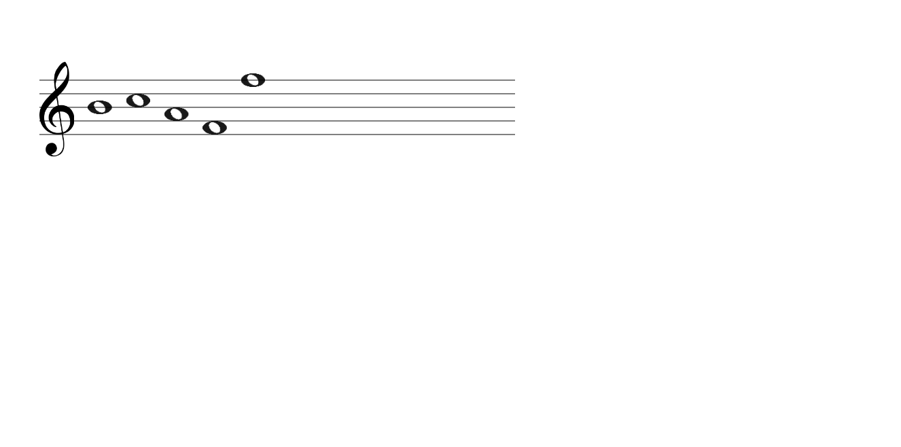
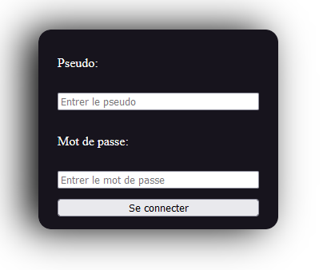

<!-- début résumé -->

Mon sheet c'est moi (POK-Temps 1)

<!-- fin résumé -->

## 1. Idée initiale

Notre idée initiale est de créer un site web qui permettrait d'écrire de la musique sur une partition intéractive, et de collaborer à plusieurs sur une même partition. L'utilisateur pourrait créer sa partition, la modifier, et la partager à d'autres utilisateurs qui pourraient la modifier à leur tour (en temps réel ou non, cela dépend de la difficulté de l'implémentation et du temps que nous aurons pour le faire).

## 2. Première version de partition interactive

Nous avons utilisé un canvas HTML pour créer une première version de la partition, qui est composée pour le moment d'une portée de 5 lignes et d'une clé de sol.

Il est possible d'ajouter des notes en cliquant sur la portée, grâce à un `EventListener` lié au canvas qui détecte les clics. Les notes ont pour le moment toutes la même durée (ce sont des rondes) mais peuvent être placées à différentes hauteurs. Elles se placent les unes à la suite des autres et ne peuvent pas encore être supprimées.

## 3. To-do list pour la suite

- ### Code de la partition en Javascript
  #### A l'aide de javascript et dans un canvas HTML, améliorer le code de la portée de telle sorte que :
    - On affiche au départ les barres de mesure (délimitations rythmiques) et les silences (symboles représentant l'absence de note) tant que les rondes ne sont pas placées
    - On puisse placer des notes (pour l'instant des rondes) où l'on veut en cliquant sur la partition, et qu'elles prennent la place des silences au lieu de s'ajouter en fin de partition
    - Quand on passe le curseur sur un emplacement vacant, une note grisée s'affiche
    - On puisse supprimer les notes en appuyant sur un bouton qui change le mode (ajouter une note/supprimer une note) 

- ### Lecture audio de la partition
  #### Liste des fonctionnalités à mettre en place :
    - Un bouton pour lancer la lecture
    - Un bouton pour changer le tempo de lecture (optionnel)

- ### Arborescence du site
  #### Créer une arborescence du site :
    - L'accueil avec description du fonctionnement du site, puis le choix entre créer une nouvelle partition ou en ouvrir une existante
    - Le choix de la partition où l'on peut retrouver les partitions sauvegardées ou en créer une nouvelle 
    - La page qui affiche la partition correspondante (et éventuellement une bulle d'aide visible d'une certaine manière), ainsi que les différents boutons qui permettent l'édition de la partition

- ### Sauvegarde des partitions
  #### Trouver un moyen de sauvegarder la partition modifiée :
    - Stocker les informations dans un fichier d'un format spécifique (json a priori)
    - Pouvoir nommer et renommer le fichier depuis le site

## 4. Avancées de la partition

### Ajouts à la partition

Nous avons ajouté de nouveaux symboles à la partition, et il est désormais possible de changer de mode d'édition avec les touches `a` (add note) et `d` (delete note). En mode suppression, il suffit de cliquer sur une note pour la supprimer et les notes restantes se repositionnent correctement.

Il reste à modifier la manière de saisir les notes pour que celles-ci puissent se placer à la place des symboles de silence et non pas en fin de partition.

### Modification de la saisie des notes

Les notes peuvent désormais être placées uniquement à la place des silences ou à la place d'autres notes. On ne peut plus supprimer que les notes et elles sont alors remplacées par des silences.

Les symboles de la portée peuvent être enregistrés et chargés à partir d'un format JSON grâce à des méthodes implémentées dans l'objet `Staff` (la portée).

Dernière version de la partition :

### Difficultés rencontrées

- Note grisée au survol de la partition

Nous pensions afficher une note grisée au survol de la partition pour indiquer la possibilité de placer une note à cet endroit. Cependant le fait de faire suivre la trajectoire de la souris à la note grisée implique d'effacer et de redessiner le canvas à chaque mouvement de la souris et cela crée un lag trop important.

Il sera peut-être possible par la suite de réduire le nombre d'actualisations du canvas en limitant les positions possibles de la note grisée à des emplacements précis mais nous avons laissé cet fonctionnalité de côté pour le moment.

- Accès à aux dimensions des images du Canvas

Lorsque que je créais une image pour l'insérer dans la partition (pour les symboles comme les notes, silences, etc.) je demandais les dimensions de l'image afin de la redimensionner tout en gardant le bon ratio. Mais les valeurs retournées étaient toujours 0. J'ai fini par comprendre en cherchant sur Internet que cela pouvait être parce que l'image n'a pas eu le temps de charger. J'ai trouvé des codes permettant d'y remédier mais ils étaient lourds et difficiles à comprendre. J'ai donc décidé pour le moment de simplement noter les ratios de toutes les images dans un dictionnaire dans le fichier JavaScript bien que ce ne soit pas la meilleure solution.

- Confusion avec le terme `class`

Le terme `class` prête à confusion car il est utilisé à la fois pour les classes des objets HTML, qui sont des sortes de catégories, et pour les classes JavaScript, en terme de Programmation Orientée Objet. Lorsque j'ai voulu tester l'appartenance d'un objet à une classe JavaScript, j'ai d'abord trouvé la syntaxe `element.classList.contains(nom_de_la_class)`, avant de me rendre compte que cela ne fonctionnait pas. En effet le terme `class` ici n'a rien à voir et je devais plutôt utiliser `object instanceof constructor` dans ce cas.

### Pistes d'améliorations possibles

- Régler d'une autre manière le problème de la taille des images qu'avec un dictionnaire placé directement dans le code.

- Mettre les données des différentes hauteurs de note (nom de la note, fréquence, etc.) en dehors du code, par exemple dans un fichier JSON ou dans une base de données, et les importer dans le fichier JavaScript au moment de créer les objets.

- Trouver un moyen d'afficher la note grisée au survol de la partition avec un affichage plus fluide, par exemple en limitant le nombre de positions auxquelles cette note peut être affichée.

- Etoffer l'édition de la partition : ajouter d'autres notes, d'autres rythmes et les silences qui vont avec, d'autres clefs, d'autres chiffrages de mesure, des altérations, des nuances, des instruments, plusieurs portées au lieu d'une seule... Il y a beaucoup de possibilités, et cela pourrait impliquer d'améliorer certaines parties du code existant pour mieux le développer.

## 5. La gestion du stockage des données

### Les données importantes à conserver 

Il y a deux types de données que nous voulons pouvoir conserver.
#### En premier lieu, les informations sur l'utilisateur :
  - Le pseudo
  - Le mot de passe
  - Les partitions dont il est l'auteur
  - Les partitions qui lui sont partagées

#### En deuxième lieu, les informations sur les partitions :
  - Les notes dans leur ordre
  - L'auteur de la partition
  - Les pseudos des personnes avec qui elle est partagée

L'objectif est pouvoir réutiliser ces données lorsque l'on parcourt le site

### Difficultés rencontrées

 A une page web est associé une base de données nommée LocalStorage qui résiste au rafraichissement de la page, et même à une fermeture du navigateur. Il peut contenir jusqu'à 5Mb, et est adapté à notre situation car facile à traiter en JavaScript. 

Le problème est que cette base de données ne traverse pas les pages. Quand on change de page HTML, on perd ces données.

Lorsque le serveur sera en ligne, nous pourrons utiliser les requêtes API pour récupérer les données nécessaires.

En attendant de pouvoir faire des requêtes API sur un serveur, on va mettre les pages en ordre et faire initialiser le LocalStorage à chaque nouvelle page par le LocalStorage de la page précédente pour tester les fonctionnalités. On va considérer donc tout le temps les mêmes conditions.

## 6. Présentation du site et parcours des données

Tout d'abord, la première page est le login : ici, on va récupérer l'identifiant de l'utilisateur et son mot de passe, et vérifier qu'il correspond à la base de données.

  

Si les identifiants ne sont pas corrects, un message d'alerte s'affiche. S'ils sont corrects, on passe à la page suivante en conservant le nom de l'utilisateur et son Id. Cet Id nous permettra de savoir à quelles partitions l'utilisateur à accès.

Ensuite on arrive sur la page d'accueil du site

On peut ici choisir si l'on veut créer une nouvelle partition ou accéder aux anciennes.

Dans le deuxième cas, on est dirigé vers les partitions sauvegardées et qui sont accessibles à l'utilisateur connecté. Les partitions contiennent dans la sauvegarde l'Id des personnes qui y ont accès, et en particulier l'auteur. On peut aussi dans cette page chosir de finalement créer une nouvelle partition.

Si l'utilisateur a choisi sur la page précédente ou sur celle-ci, il se retrouve face à une partition vierge. Sinon il arrive directement sur la partition sauvegardée au préalable.

### Améliorations possibles

La plupart des améliorations concernant les données seront applicables lorsque l'on mettra le site sur un serveur, dans le second temps. 

- Que l'on puisse stocker les données utilisateur et les partitions de manière durable dans un stockage associé au serveur

- Il faudrait que le mot de passe de l'utilisateur soit crypté

- Améliorer le CSS des différentes pages. 

- Cela parait compliqué, mais faire en sorte qu'une partition puisse être traitée par plusieurs personnes à la fois, à la manière de google drive, serait idéal. Peut-être un serveur pourrait nous offrir cette possibilité.