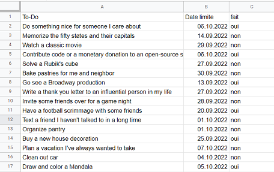
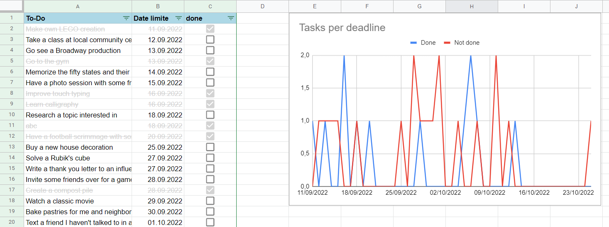

<!-- Début Résumé -->
Ici je vais mettre les informations sur mon MON de temps 1, Google Apps Script.
<!-- fin résumé -->

## But du projet
Le but de ce projet, c'est de créer une liste de tâches à faire ("To-Do") dans Google Sheets, qui est mise à jour automatiquement à chaque fois que je modifie la liste dans Google Sheets.

## Résultat
### État de la table au debut


### Etat de la table après l'exécution du script


## Déroulement du projet
1. Tutoriel sur YouTube
2. Reconstruit le projet du tutoriel
3. Création d'un plan pour le projet to-do (le but du projet)
4. Creation de la liste des tâches avec une API (https://dummyjson.com/todos)
5. Trier la liste (par date de fin) et correction d'erreur (au début, l'en-tête du tableau a également été trié)
6. Récupérer le statut "terminé" et le convertir en case à cocher
7. Griser les tâches accomplies
8. Génération d'un charte basique á la base de la documentation
9. Travailler avec le debugger pour identifier des fautes 
10. Création d'une fonction permettant de compter le nombre de tâches effectuées/non effectuées par jour
    - J'ai d'abord fait, sans trop réfléchir, quelques essais naïfs avec des tableaux et JSON, qui n'ont abouti à rien.
    - Ensuite, j'ai imaginé un algorithme (voir ci-dessous) que j'ai ensuite converti en code.
    - Cette tâche a pris beaucoup plus de temps que prévu, car je n'ai pas encore beaucoup d'expérience dans le traitement des données et dans les opérations sur les arrays, les listes, les dictionnaires etc.
11. Création d'un graphique avec le nombre de tâches effectuées/non effectuées par jour 
12. Appeller la fonction a chaque modification de la feuille (onEdit)
13. Nettoyage : externaliser dans des fonctions, supprimer le logging qui n'est pas necessaire
14. Documentation du code

Le code est disponible sur Pastebin : https://pastebin.com/ttNg5rMX

## Algorithme de traitement des dates
1. trouver la première date
2. trouver la dernière date
3. créer un tableau auxiliaire, une ligne pour chaque jour entre la première et la dernière date, initialiser avec 0 pour le nombre de tâches terminées et 0 pour le nombre de tâches ouvertes : | date | nombre de tâches terminées | nombre de tâches ouvertes |.
4. pour chaque ligne de la liste des choses à faire :
    1. trouver la date de la ligne
    2. dans le tableau d'aide, chercher la date
    3. dans le tableau d'aide : Si la ligne de la liste des choses à faire est terminée, augmenter le nombre terminé de 1, sinon augmenter le nombre ouvert de 1.
5. créer un graphique avec les données du tableau auxiliaire

## Exemples de code
Ici je veux montrer quelques exemples intéressants de code que j'ai écrit pour ce projet.

### Implémentation de l'algorithme de traitement des dates
```javascript
var datesAndDoneColumnRange = activeSheet.getRange(2,2,lastRow-1, 2); //get range that includes the dates and done values (done/not done)
var dateAndDoneValues = datesAndDoneColumnRange.getValues(); // get the values from this range -> Array[Date][done]

// create new sheet to store temporary data
var temporarySheet = SpreadsheetApp.getActiveSpreadsheet().getSheetByName('temporary-data');
temporarySheet.clear(); // clear the temporary sheet
temporarySheet.getRange(1,1,1,3).setValues([["Date", "Done", "Not done"]]); // create header in the temporary sheet

var firstDay = new Date(dateAndDoneValues[0][0]); // get first array element
var lastDate = new Date(dateAndDoneValues.slice(-1)[0][0]); //get last array element

// iterate through all dates in the range: https://stackoverflow.com/questions/4345045/loop-through-a-date-range-with-javascript
var allDates = []; // array where all dates will be saved
for (let d = firstDay; d <= lastDate; d.setDate(d.getDate() + 1)) {
  let newDate = new Date(d);
  allDates.push([newDate.toLocaleDateString('fr-FR'),0,0]);
}
temporarySheet.getRange(2, 1, allDates.length, 3).setValues(allDates); // write the array with all dates to the temporary sheet

// iterate throug dateAndDoneValues and read them
dateAndDoneValues.forEach(function(row, index) {
  let currentDate = new Date(row[0]);
  let currentDoneState = row[1];
  let currentRow = temporarySheet.createTextFinder(currentDate.toLocaleDateString('fr-FR')).findNext().getRow();

  if (currentDoneState == true) {
    temporarySheet.getRange(currentRow, 2).setValue(temporarySheet.getRange(currentRow, 2).getValue() + 1); // increase value of "done" by 1
  } else if (currentDoneState == false) {
    temporarySheet.getRange(currentRow, 3).setValue(temporarySheet.getRange(currentRow, 3).getValue() + 1); // increase value of "not done" by 1
  } else {
    Logger.log('Impossible state, currentDoneState is neither true nor false'); // this case should never happen
  }
});
```
### Trier par Date
Dans Google Sheet, c'est très facile de trier par colonne:
```javascript
  dataSection.sort(2); // 2 = 2nd column which includes the date
```

## Ce que je n'ai pas pu faire de plus
Au cours des 10h que j'ai investies dans ce projet, je n'ai malheureusement pas réussi à faire certaines choses non plus :
- Intercepter des edge cases (par exemple lorsqu'il n'y a pas de date dans la colonne des dates).
- Essayer différents types de graphiques
- Améliorer l'efficacité du script

## Ressources utilisées
- Tutoriel sur YouTube: https://www.youtube.com/watch?v=Nd3DV_heK2Q
- Documentation sur Google Apps Script en utilisant avec Google Sheets: https://developers.google.com/apps-script/reference/spreadsheet/
- Documentation de la génération de graphiques: https://developers.google.com/apps-script/reference/spreadsheet/embedded-chart
- Documentation du debugger: https://developers.google.com/apps-script/guides/support/troubleshooting#debugging
- Documentation de la fonction onEdit: https://developers.google.com/apps-script/guides/triggers#onedite)
- Documentation des Arrays in JavaScript: https://developer.mozilla.org/en-US/docs/Web/JavaScript/Reference/Global_Objects/Array
- Documentation de la fonction Date in JavaScript: https://developer.mozilla.org/en-US/docs/Web/JavaScript/Reference/Global_Objects/Date
- Itérer par les dates: https://stackoverflow.com/questions/4345045/loop-through-a-date-range-with-javascript

## Conclusion
- Google Apps Script est un outil très puissant pour automatiser des tâches répétitives. Il s'agit pour ainsi dire de JavaScript conçu pour les Google Apps. Google met à disposition des classes spéciales pour les Google Apps, qui permettent d'interagir avec les applications.
- J'ai appris pas mal de choses, notamment en rafraîchissant mes connaissances en JavaScript, et je pense que je vais maintenant automatiser plus souvent quelque chose dans Google Apps Script.
- Néanmoins, Google Apps Script n'est pas adapté aux développements sérieux qui dépassent le cadre des produits Google. Il ne peut être développé qu'en ligne dans l'éditeur Google et le debugger n'a que peu de fonctionnalités. Pour les débutants et les petits projets, Goole Apps Script est toutefois très bien adapté.

[<-- Retour](../)